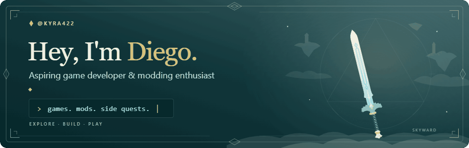
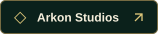
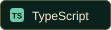
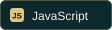
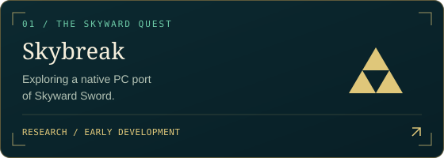
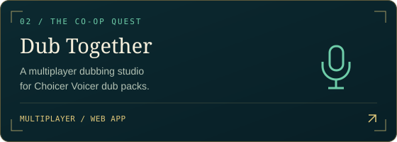

  <picture>
    <source media="(prefers-reduced-motion: reduce)" srcset="./assets/header-skyward-3d.png">
    
  </picture>

  
  &nbsp;
  

## About the adventurer

Hey, I'm **Diego**, also known as **Kyra422**. I'm an aspiring game developer and modding enthusiast. I like tinkering with games and making websites and applications on the side — sometimes useful, sometimes just for the fun of it.

- **Main quest: games & mods** — exploring how games work and what I can build with them.
- **Side quests** — turning random ideas into something I can click, play, or break.
- **New discoveries** — a mix of tools, little websites, and things nobody asked for.

## Inventory

  
  
  
  

Games, modding, and web development. Different tools for different side quests.

## Quest board

  
  &nbsp;
  

**[Arkon Studios](https://kyra422.github.io/)** — my studio website, with Discord tools, Roblox experiences, and Unity game projects.

<b>Open the side-quest journal</b>

 

Some projects start with a plan. Others start with **“what if?”**

That's where the game experiments, mods, and wonderfully unnecessary websites come in.

Every good adventure leaves room for a detour.

 

  

Sword model by <a href="https://sketchfab.com/mescri">mescri</a>, adapted with custom materials and animation. <a href="./assets/SWORD-CREDITS.md">Credits and CC BY-SA 4.0 license</a>.

